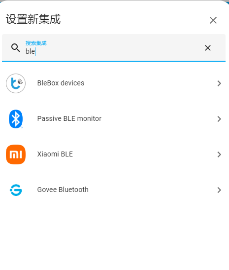
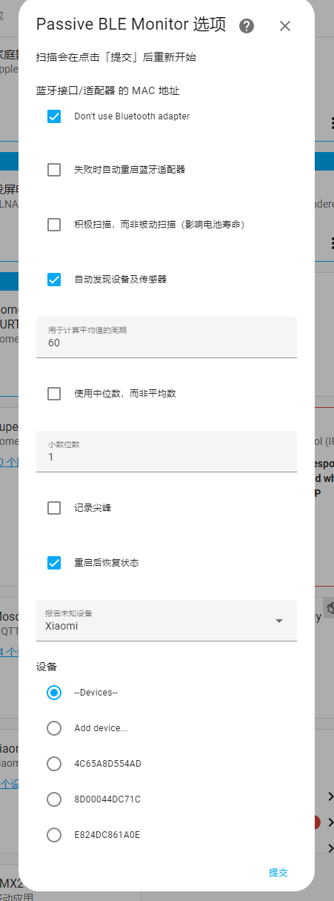
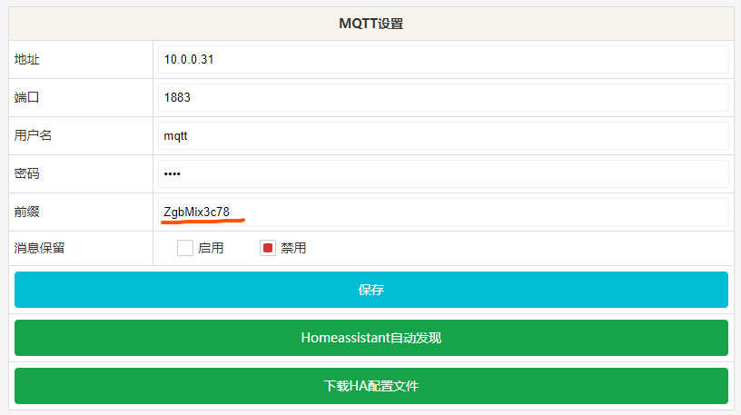

# 烧录

下载tool中的脚本，准备esp32C3 4M版本，接入ttl运行flash脚本即可完成烧写

# WiFi配置

下载完成后设备将自动进入热点模式，手机链接生成的相关热点Esp2bmtXXX 链接配置即可

请注意不要将该wifi处于极弱信号区，由于esp设备2.4g wifi和ble共用一个天线时间片且由软件调度，过低的wifi信号会严重影响设备mqtt及ble调度时间. C3采用ble5.0天线且软件增加了射频12dbm+,可以维持良好的收发效果，故应当优先维持wifi信号以确保数据上行链路。

# Ble_Monitr 

目前 该组件未列入集成，建议安装Hacs后再由ha界面安装即可。

## HACS

https://hacs.xyz/docs/setup/download

请自行参考以上链接脚本安装、进入hacs后，添加Passive BLE monitor integration


# Ble Monitor

以上步骤完成后，请在HA 集成中添加passsive ble monitor



添加完成后,点击选项，勾选不需要使用ble适配器第一个，添加重启后恢复状态， 设备地方按你的蓝牙设备添加即可，如果不知道地址等信息，你可以使用工具进入小米后台来获取，参考以下链接

https://custom-components.github.io/ble_monitor/faq#how-to-get-the-mibeacon-v4v5-encryption-key



# HA配置


```
automation:
  - alias: ESPHome BLE Advertise
    mode: queued
    trigger:
      - platform: mqtt
        topic: "ZgbMix3c78/ble/report"
    action:
      - service: ble_monitor.parse_data
        data:
          packet: "{{ trigger.payload }}"
          #gateway_id: "{{ trigger.event.data.gateway_id }}" # Optional. If your gateway sends.
```

 - topic: "ZgbMix3c78/ble/report"   该主题需要按实际修改，
 
如果你采用多个C3设备同时读取，则需要将MQTT配置主题prefix改成一样即可，注意不要将WEB主机名也改成一样的，以免造成不必样的麻烦




# TODO

- 增加MQTT上报过滤列表减轻HA ble_monitor队列处理容量